# TÀI LIỆU PHÂN TÍCH THIẾT KẾ HỆ THỐNG

## I.Xác định yêu cầu

Quản Lý Tạp Hóa là một hệ thống quản lý cửa hàng tạp hóa được thiết kế để giúp các chủ cửa hàng nhỏ lẻ dễ dàng:

    -Quản lý hàng hóa và tồn kho

    -Theo dõi doanh thu bán hàng

    -Quản lý thông tin khách hàng

    -Tạo báo cáo kinh doanh

### 1. **Yêu cầu chức năng (Functional Requirements)**

**1.1. Quản lý sản phẩm**

    -Thêm sản phẩm mới.
    -Sửa thông tin sản phẩm (tên, giá, số lượng, danh mục…).
    -Xóa hoặc tạm ẩn sản phẩm khỏi danh sách bán.
    -Tìm kiếm và lọc sản phẩm theo tên, mã, danh mục.

**1.2. Quản lý kho hàng**

    -Nhập kho (cập nhật số lượng).
    -Xuất kho tự động khi bán hàng.
    -Cảnh báo hàng tồn kho thấp.
    -Ghi nhận lịch sử nhập – xuất kho.
    -Quản lý hạn sử dụng

**1.3. Quản lý khách hàng**

    -Lưu thông tin khách hàng thân thiết.

**1.4. Quản lý nhà cung cấp**

    -Thêm và lưu thông tin nhà cung cấp.
    -Theo dõi các lần nhập hàng từ nhà cung cấp.
    -Ghi lịch sử nợ / thanh toán với nhà cung cấp.

**1.5. Báo cáo – Thống kê**

    -Báo cáo doanh thu theo ngày, tuần, tháng.
    -Báo cáo lãi – lỗ.
    -Báo cáo hàng tồn kho.
    -Biểu đồ sản phẩm bán chạy / bán chậm.

### 2. **Yêu cầu phi chức năng (Non-functional Requirements)**

**2.1. Hiệu năng**

    -Giao diện bán hàng phải xử lý nhanh, không bị giật lag.

**2.2. Bảo mật**

    -Phân quyền truy cập rõ ràng.

    -Mã hóa mật khẩu

    -Lưu lịch sử thay đổi dữ liệu.

**2.3. Khả năng mở rộng**

    -Cho phép thêm module quản lý online.

**2.4. Tính thân thiện & dễ dùng**

    -Giao diện đơn giản dành cho chủ tiệm không rành công nghệ.

    -Thao tác tối đa 1–2 bước để hoàn tất một giao dịch bán hàng.

**2.5. Sao lưu dữ liệu**

    -Tự động backup dữ liệu.

    -Khôi phục dữ liệu khi có sự cố.

### 3. **Yêu cầu dữ liệu (Data Requirements)**

**3.1. Bảng sản phẩm (Products)**

    -Mã hàng

    -Tên hàng

    -Đơn giá

    -Số lượng tồn

    -Hạn sử dụng

    -Nhà cung cấp

**3.2. Bảng hóa đơn (Invoices)**

    -Mã hóa đơn
    -Ngày giờ
    -Tổng tiền
    -Hình thức thanh toán

### 4. **Yêu cầu tích hợp (Integration Requirements)**

    -Tích hợp thanh toán QR.

## I-Quy trình quản lý khách hàng

### 1. Tiếp nhận khách hàng

- Khách đến mua trực tiếp
- Nhân viên chào hỏi, tư vấn
- Ghi nhận nhu cầu mua hàng

### 2. Thu thập thông tin khách hàng

(Với khách quen / mua thường xuyên)

Thông tin cơ bản:

- Tên khách hàng
- Số điện thoại
- Địa chỉ (nếu giao hàng)
- Thói quen mua (mặt hàng thường mua)

  Ngoài ra có thể ghi:
- Sổ khách hàng
- File Excel
- Phần mềm quản lý bán hàng

### 3. Phân loại khách hàng

- **Khách lẻ** : mua không thường xuyên
- **Khách quen** : mua nhiều lần
- **Khách sỉ** : mua số lượng lớn
- **Khách nợ** (nếu có): mua trước – trả sau

### 4. Chăm sóc khách hàng

- Nhớ mặt, nhớ tên khách quen
- Ưu tiên phục vụ nhanh
- Giới thiệu sản phẩm mới
- Nhắc khuyến mãi, giảm giá
- Giao hàng tận nơi (nếu có)

### 5. Quản lý công nợ khách hàng (nếu bán thiếu)

1. Ghi rõ:
   - Tên khách
   - Ngày mua
   - Số tiền nợ
2. Theo dõi thời gian trả
3. Nhắc khách lịch sự
4. Cập nhật khi khách thanh toán

### 6. Tiếp nhận phản hồi – khiếu nại

- Lắng nghe ý kiến khách hàng
- Ghi nhận phản hồi
- Xin lỗi khi cần thiết
- Đổi/trả hàng lỗi
- Cải thiện dịch vụ

### 7. Đánh giá khách hàng định kỳ

- Tần suất mua hàng
- Tổng giá trị mua
- Mức độ hài lòng
- Khả năng trở thành khách trung thành

## II- Quy trình quản lý thống kê

### 1. Thống kê bán hàng hằng ngày

- Tổng số đơn bán
- Tổng doanh thu
- Sản phẩm bán chạy
- Sản phẩm bán chậm

  Ghi vào sổ hoặc phần mềm cuối ngày

### 2. Thống kê tồn kho

- Số lượng hàng còn lại
- Hàng sắp hết
- Hàng tồn lâu
- Hàng sắp hết hạn

Thực hiện theo:

- Ngày
- Tuần
- Tháng

### 3. Thống kê chi phí

- Tiền nhập hàng
- Tiền điện nước
- Lương nhân viên
- Chi phí phát sinh khác

### 4. Thống kê lợi nhuận

**Lợi nhuận = Doanh thu – Chi phí**

- Tính theo:
  - Ngày
  - Tháng
  - Quý

### 5. Báo cáo tổng hợp cho chủ quán

Nội dung báo cáo gồm:

- Doanh thu
- Lợi nhuận
- Hàng bán chạy
- Hàng cần nhập thêm
- Hàng tồn kho lâu

## 1.2.3.4.5.Đặc tả Yêu cầu và Nghiệp vụ Hệ thống

Hệ thống được thiết kế để đáp ứng các tiêu chuẩn về chức năng, hiệu năng và quy trình nghiệp vụ đặc thù của ngành bán lẻ tạp hóa như sau:

### Yêu cầu Phi chức năng

- **An toàn và Bảo mật thông tin:**
  - Hệ thống đảm bảo cơ chế mã hóa dữ liệu quan trọng.
  - Đặc biệt, các dữ liệu về **doanh thu, lợi nhuận và giá vốn** được xếp loại tuyệt mật, chỉ cấp quyền truy cập cho nhóm đối tượng quản trị cấp cao.
- **Trải nghiệm người dùng (UX/UI):**
  - Giao diện được thiết kế khoa học, trực quan, giảm thiểu thao tác thừa để tăng tốc độ bán hàng.
  - Tích hợp bộ lọc đa chiều và công cụ tìm kiếm thông minh (theo tên hàng, mã vạch, mã phiếu...) giúp tra cứu dữ liệu tức thời.
- **Khả năng kết nối:**
  - Hệ thống hoạt động ổn định trên môi trường mạng nội bộ (LAN/Wifi).
  - Đảm bảo kết nối liền mạch với các thiết bị ngoại vi (máy in, két tiền, cân điện tử).

### Phân quyền Người dùng

Hệ thống áp dụng cơ chế phân quyền theo vai trò (RBAC) chặt chẽ:

1. **Quản trị viên (Admin):** Có toàn quyền hệ thống (Full Control), quản lý danh sách người dùng và cấu hình tham số phần mềm.
2. **Người Quản lý (Manager):** Truy cập các báo cáo quản trị, quản lý nhân sự và có quyền duyệt các phiếu nghiệp vụ quan trọng (phiếu nhập, phiếu hủy hàng).
3. **Thủ kho (Warehouse Keeper):** Thực hiện các tác vụ nhập/xuất hàng hóa, lập phiếu đề nghị hủy hàng và thực hiện kiểm kê kho định kỳ.
4. **Nhân viên Thu ngân (Cashier):** Quyền hạn bị giới hạn trong giao diện bán hàng (POS) để thực hiện thanh toán và in hóa đơn.
5. **Nhân viên Quầy cân (Fresh Food Staff):** Chỉ sử dụng giao diện tích hợp với cân điện tử để in tem nhãn cho hàng tươi sống.

### Yêu cầu Nghiệp vụ Chi tiết

Hệ thống phải tuân thủ và tự động hóa các quy trình nghiệp vụ cốt lõi sau:

1. **Quản lý Lô và Hạn sử dụng :**
   - Hệ thống **bắt buộc** người dùng (Thủ kho) phải nhập đầy đủ thông tin _Hạn sử dụng_ và *Mã lô *khi tạo phiếu nhập kho. Đây là điều kiện tiên quyết để lưu dữ liệu nhập kho.
2. **Tích hợp Cân điện tử :**
   - Hệ thống có khả năng kết nối với cân điện tử in tem nhãn qua mạng LAN/Wifi để đồng bộ danh mục hàng hóa xuống cân.
3. **Xử lý Mã vạch thông minh :**
   - Tại quầy thu ngân, hệ thống tích hợp thuật toán tự động nhận diện và bóc tách dữ liệu từ mã vạch do cân in ra (loại mã vạch chứa thông tin khối lượng/giá tiền) để thêm vào giỏ hàng mà không cần nhập thủ công.
4. **Nguyên tắc Xuất kho FIFO :**
   - Hệ thống tự động hóa quy trình trừ tồn kho theo nguyên tắc **"Nhập trước - Xuất trước"** . Khi bán hàng, hệ thống ưu tiên trừ số lượng của các lô hàng có hạn sử dụng gần nhất hoặc thời gian nhập sớm nhất.
5. **Cảnh báo Hàng cận date :**
   - Cung cấp Dashboard hoặc hệ thống thông báo (Notification) tự động cảnh báo danh sách hàng hóa sắp hết hạn sử dụng để quản lý có phương án xử lý kịp thời.
6. **Quản lý Hủy hàng & Kiểm kê :**
   - Hỗ trợ quy trình lập và duyệt "Phiếu hủy hàng" cho sản phẩm hư hỏng/hết hạn.
   - Hệ thống tự động điều chỉnh số lượng tồn kho và ghi nhận lịch sử (Log) chính xác sau khi phiếu hủy hoặc phiếu kiểm kê được duyệt.
     -- Ngày 9/1/2026 - Nhiệm vụ : Viết mô tả quy trình ( quản lý sản phẩm )

## QUY TRÌNH QUẢN LÝ SẢN PHẨM

### I. Thêm sản phẩm mới

1. Người quản lý truy cập màn hình Quản lý sản phẩm
2. Chọn chức năng Thêm sản phẩm
3. Hệ thống sẽ hiển thị lên form giao diện nhập liệu
4. Nhập thông tin sản phẩm:
   - Tên sản phẩm
   - Danh mục
   - Giá nhập
   - Giá bán
   - Số lượng tồn kho ban đầu
5. Xác nhận lưu
6. Hệ thống:
   - Lưu sản phẩm vào cơ sở dữ liệu
   - Gán sản phẩm vào danh mục tương ứng
   - Hiển thị sản phẩm trong danh sách

### II. Sửa thông tin sản phẩm

1. Người dùng chọn một sản phẩm trong danh sách
2. Chọn Chỉnh sửa
3. Cập nhật thông tin cần thay đổi (giá, danh mục, số lượng,…)
4. Lưu thay đổi
5. Hệ thống:
   - Cập nhật dữ liệu
   - Ghi nhận lịch sử thay đổi

### III. Xóa sản phẩm

1. Người dùng chọn sản phẩm
2. Chọn Xóa
3. Hệ thống hiển thị hộp thoại xác nhận
4. Người dùng xác nhận xóa
5. Hệ thống:
   - Xóa sản phẩm khỏi danh sách
   - Không cho phép xóa nếu sản phẩm đang tồn tại trong đơn hàng (nếu áp dụng)

### IV. Phân loại theo danh mục

1. Mỗi sản phẩm được gán một danh mục khi tạo hoặc chỉnh sửa
2. Người dùng có thể:
   - Lọc sản phẩm theo danh mục
   - Tìm kiếm nhanh theo tên hoặc loại
3. Hệ thống hiển thị danh sách sản phẩm tương ứng

### V. Theo dõi giá nhập và giá bán

1. Giá nhập và giá bán được lưu riêng cho từng sản phẩm
2. Khi xem chi tiết sản phẩm:
   - Hệ thống hiển thị rõ giá nhập và giá bán
3. Hỗ trợ:
   - So sánh lợi nhuận
   - Phân tích doanh thu (nếu mở rộng)

### VI. Cảnh báo hết hàng / sắp hết hàng

1. Hệ thống theo dõi số lượng tồn kho theo thời gian thực
2. Khi:
   - Số lượng ≤ ngưỡng cảnh báo → Sắp hết hàng
   - Số lượng = 0 → Hết hàng
3. Hệ thống:
   - Hiển thị cảnh báo trên giao diện
   - Đánh dấu sản phẩm bằng màu sắc/trạng thái
   - Ngăn bán nếu sản phẩm đã hết hàng (nếu cấu hình)

## QUY TRÌNH QUẢN LÝ BÁN HÀNG

### I. Tạo đơn hàng

1. Nhân viên truy cập màn hình Bán hàng
2. Chọn hoặc tìm sản phẩm
3. Nhập số lượng cần bán
4. Sản phẩm được thêm vào đơn hàng
5. Hệ thống:
   - Tự động tính tổng tiền từng sản phẩm
   - Kiểm tra tồn kho

### II. Tính tiền tự động

1. Khi thêm/xóa/thay đổi số lượng sản phẩm:
   - Hệ thống tự động cập nhật:
2. Hiển thị tổng tiền cuối cùng theo thời gian thực

### III. Thanh toán

1. Nhân viên chọn **phương thức thanh toán :**
   - Tiền mặt
   - Chuyển khoản
2. Nhập số tiền khách đưa (nếu thanh toán tiền mặt)
3. Hệ thống:
   - Tính tiền thừa
   - Xác nhận thanh toán thành công

### IV. In hóa đơn

1. Sau khi thanh toán:
   - Nhân viên chọnIn hóa đơn
2. Hệ thống:
   - Tạo hóa đơn chứa:
   - Gửi lệnh in đến máy in
3. Hóa đơn được lưu để:
   - Tra cứu lịch sử bán hàng
   - Báo cáo doanh thu

## 1.2.3. Hoạt động Quản lý Kho Hàng (Nhập – Xuất – Tồn – Hủy)

### • Quản lý Nhập hàng

- Khi hàng trong kho gần hết, **chủ quán hoặc người bán** sẽ liên hệ trực tiếp với **nhà cung cấp** để nhập thêm hàng.
- Khi hàng được giao đến quán:
  - Kiểm tra **số lượng** và **tình trạng hàng hóa** .
  - Đối với các mặt hàng có **Hạn sử dụng (HSD)** như: sữa, nước giải khát, mì gói, bánh kẹo…, hệ thống cho phép nhập:
- Sau khi kiểm tra xong, người bán lập **Phiếu nhập hàng** trên hệ thống.
- Việc thanh toán cho nhà cung cấp có thể:
  - Thanh toán ngay
  - Hoặc ghi nhận **công nợ** (nếu mua thiếu)

### • Quản lý Tồn kho

- Hệ thống quản lý tồn kho **chi tiết theo từng lô và hạn sử dụng** , không chỉ tổng số lượng.
- Điều này giúp chủ quán:
  - Biết chính xác mặt hàng nào **sắp hết hạn**
  - Hạn chế thất thoát do quên kiểm tra hàng tồn

### • Quản lý Xuất/Bán hàng

- Trong quán tạp hóa:
  - **Xuất kho chính là bán hàng cho khách**
  - Không phân tách kho chính – quầy như siêu thị lớn
- Khi bán hàng:
  - Người bán quét mã hoặc chọn sản phẩm
  - Hệ thống **tự động trừ tồn kho**
- Để giảm hàng hết hạn:
  - Hệ thống tự động áp dụng nguyên tắc **FIFO (Nhập trước – Xuất trước)**
  - Luôn ưu tiên trừ hàng thuộc **lô có HSD gần nhất**
- Chủ quán **không cần chọn lô thủ công** , hệ thống xử lý tự động.

### • Quản lý hàng hỏng / hết hạn

- Hàng hỏng, hết hạn, móp méo, chuột cắn… là tình huống thường gặp trong quán tạp hóa.
- Định kỳ (cuối ngày hoặc vài ngày/lần), người bán:
  - Kiểm tra hàng trên kệ
  - Thu hồi các sản phẩm không còn bán được
- Khi phát hiện hàng hỏng:
  - Lập **Phiếu hủy hàng** trên hệ thống
- Sau khi xác nhận:
  - Hệ thống trừ số lượng này khỏi tồn kho
  - Ghi nhận **chi phí thất thoát** , giúp chủ quán biết mình lỗ do đâu.

## 1.2.4. Hoạt động Quản lý Nhà Cung Cấp

### • Mục tiêu

Quản lý thông tin các **đầu mối bỏ sỉ** (đại lý nước ngọt, bánh kẹo, sữa, mì gói…) để:

- Nhập hàng nhanh
- Theo dõi công nợ
- Dễ so sánh giá và chất lượng hàng

### • Các chức năng chính

1. **Thêm nhà cung cấp mới**
   - Khi có mối bỏ sỉ mới
2. **Cập nhật thông tin nhà cung cấp**
   - Khi đổi số điện thoại, địa chỉ, người giao hàng
3. **Ngừng sử dụng nhà cung cấp**
   - Khi không còn nhập hàng nữa (không xóa để giữ lịch sử)

### • Thông tin cần quản lý

- Mã nhà cung cấp
- Tên nhà cung cấp / Tên đại lý
- Địa chỉ
- Số điện thoại
- Email (nếu có)
- Người liên hệ / Người giao hàng
- Danh sách các mặt hàng thường cung cấp
- Công nợ hiện tại (nếu có)

## Phân tích thiết kế hệ thống theo UML

### 1. Các biểu đồ UseCase

#### 1.1 Xác định các Tác nhân

Dựa trên mô tả quy trình hoạt động, các đối tượng tương tác với hệ thống được xác định là các tác nhân sau:

- **Người Quản trị (Admin):** Là người chịu trách nhiệm về mặt kỹ thuật của hệ thống. Có toàn quyền hệ thống, đồng thời chịu trách nhiệm quản lý tài khoản người dùng và phân quyền.
- **Chủ cửa hàng:** Là người có quyền cao nhất trong các hoạt động nghiệp vụ. Chịu trách nhiệm quản lý tổng thể, duyệt các phiếu quan trọng (phiếu hủy), quản lý thông tin nền tảng (hàng hóa, danh mục (ngành hàng), nhà cung cấp, nhân viên) và xem các báo cáo thống kê.
- **Nhân viên :** Là người làm việc tại cửa hàng, sử dụng hệ thống cân điện tử, máy quét mã vạch, máy in để thực hiện bán hàng

· Các tác nhân bên ngoài:

- **Khách hàng** : Tác nhân bên ngoài, không đăng nhập vào hệ thống. Là người khởi tạo quy trình bán hàng bằng cách lựa chọn hàng hóa và thanh toán.
- **Nhà cung cấp** **:** Tác nhân bên ngoài. Là đối tượng cung cấp hàng hóa cho cửa hàng.
- **Cân điện tử:** Tác nhân phần cứng bên ngoài, tương tác trực tiếp với hệ thống và Nhân viên. Nó nhận lệnh chọn mã hàng, tự động ghi nhận trọng lượng, truy vấn đơn giá từ hệ thống, tính thành tiền và in ra tem nhãn mã vạch chứa giá tiền để Nhân viên có thể quét.
- **Máy quét mã vạch:** Là thiết bị phần cứng ngoại vi, công cụ tương tác chính của Nhân viên trong nghiệp vụ bán hàng. Nó có chức năng đọc và giải mã thông tin từ mã vạch (barcode) được in trên sản phẩm hoặc tem nhãn và chuyển đổi thành dữ liệu số để gửi vào hệ thống phần mềm.
- **Máy in**: Là thiết bị phần cứng ngoại vi, có chức năng nhận dữ liệu từ hệ thống và in ra hóa đơn chi tiết trong nghiệp vụ bán hàng.

Dựa trên mô tả quy trình hoạt động, các đối tượng tương tác với hệ thống được xác định là các tác nhân sau:

- **Người Quản trị (Admin):** Là người chịu trách nhiệm về mặt kỹ thuật của hệ thống. Có toàn quyền hệ thống, đồng thời chịu trách nhiệm quản lý tài khoản người dùng và phân quyền.
- **Chủ cửa hàng:** Là người có quyền cao nhất trong các hoạt động nghiệp vụ. Chịu trách nhiệm quản lý tổng thể, duyệt các phiếu quan trọng (phiếu hủy), quản lý thông tin nền tảng (hàng hóa, danh mục (ngành hàng), nhà cung cấp, nhân viên) và xem các báo cáo thống kê.
- **Nhân viên :** Là người làm việc tại cửa hàng, sử dụng hệ thống cân điện tử, máy quét mã vạch, máy in để thực hiện bán hàng

· Các tác nhân bên ngoài:

- **Khách hàng** : Tác nhân bên ngoài, không đăng nhập vào hệ thống. Là người khởi tạo quy trình bán hàng bằng cách lựa chọn hàng hóa và thanh toán.
- **Nhà cung cấp** **:** Tác nhân bên ngoài. Là đối tượng cung cấp hàng hóa cho cửa hàng.
- **Cân điện tử:** Tác nhân phần cứng bên ngoài, tương tác trực tiếp với hệ thống và Nhân viên. Nó nhận lệnh chọn mã hàng, tự động ghi nhận trọng lượng, truy vấn đơn giá từ hệ thống, tính thành tiền và in ra tem nhãn mã vạch chứa giá tiền để Nhân viên có thể quét.
- **Máy quét mã vạch:** Là thiết bị phần cứng ngoại vi, công cụ tương tác chính của Nhân viên trong nghiệp vụ bán hàng. Nó có chức năng đọc và giải mã thông tin từ mã vạch (barcode) được in trên sản phẩm hoặc tem nhãn và chuyển đổi thành dữ liệu số để gửi vào hệ thống phần mềm.
- **Máy in**: Là thiết bị phần cứng ngoại vi, có chức năng nhận dữ liệu từ hệ thống và in ra hóa đơn chi tiết trong nghiệp vụ bán hàng.

#### 1.2 Xác định các USECASE

| Nhóm chức năng (UC tổng thể)           | Use Case con                            | Mô tả                                                                                                                                                                                   | Tác nhân chính                                                 |
| :------------------------------------------ | --------------------------------------- | ----------------------------------------------------------------------------------------------------------------------------------------------------------------------------------------- | ----------------------------------------------------------------- |
|                                             | Đăng nhập                            | Xác thực người dùng (username/password) trước khi cho phép truy cập hệ thống.                                                                                             | Người Quản trị, Người Quản lý, Nhân viên Thu ngân |
| **1.Quản trị Hệ thống**           | Quản lý phân quyền người dùng    | **(** Thêm,sửa, xóa tài khoản) và gán quyền (vai trò) cho người dùng                                                                                               | Người Quản trị                                                |
| **2. Quản lý Bán hàng**           | Thanh toán Hóa đơn                  | Ghi nhận các mặt hàng (quét mã vạch hàng khô và tính tổng tiền, xử lý thanh toán, in hóa đơn.  (Tự động trừ số lượng kho theo FIFO khi hoàn tất) | Nhân viên Thu ngân                                             |
| **3.Quản lý Kho hàng**            | Nhập hàng vào kho                    | Lập phiếu nhập kho. Bắt buộc ghi nhận thông tin Mã lô Hàng, Ngày sản xuất, và Hạn sử dụng (HSD)  cho hàng thực phẩm                                         | Người Quản trị                                                |
|                                             | Xuất hàng ra quầy                    | Lập phiếu xuất hàng từ kho lưu trữ ra quầy kệ. Hệ thống tự động đề xuất xuất từ Lô có HSD cũ nhất (FIFO).                                                  | Người Quản trị                                                |
| **4. Quản lý Dữ liệu nền tảng** | Quản lý Danh mục (Ngành hàng)      | Thêm, sửa, xóa các danh mục/ngành hàng                                                                                                                                             | Người Quản trị                                                |
|                                             | Quản lý Hàng hóa (Sản phẩm)       | Thêm, sửa, xóa thông tin hàng hóa (Mã, Tên, Đơn giá, Đơn vị tính…). Bắt buộc gán hàng  hóa vào một Danh mục (Ngành hàng).                           | Người Quản trị                                                |
|                                             | Quản lý Nhà cung cấp                | Thêm, sửa, xóa, vô hiệu hóa thông tin nhà cung cấp (Tên, Địa chỉ, SĐT, Mặt hàng cung cấp...).                                                                      | Người Quản trị                                                |
|                                             | Quản lý Khách hàng                  | Thêm, sửa, xóa thông tin khách hàng , phân cấp                                                                                                                                    | Người Quản trị                                                |
| **5.Thống kê & Báo cáo**         | Xem Báo cáo Doanh thu                 | Thống kê doanh thu, số lượng hàng bán theo tháng, quý.                                                                                                                     | Người Quản trị                                                |
|                                             | Xem Báo cáo Hàng sắp hết hạn      | Cảnh báo các Lô hàng sẽ hết hạn trong N ngày tới                                                                                                                                | Người Quản trị                                                |
|                                             | Xem Báo cáo Hàng hủy (Thất thoát) | Thống kê chi phí, số lượng hàng đã bị hủy                                                                                                                                      | Người Quản trị                                                |

#### 1.3 Biều đồ USECASE tổng quát

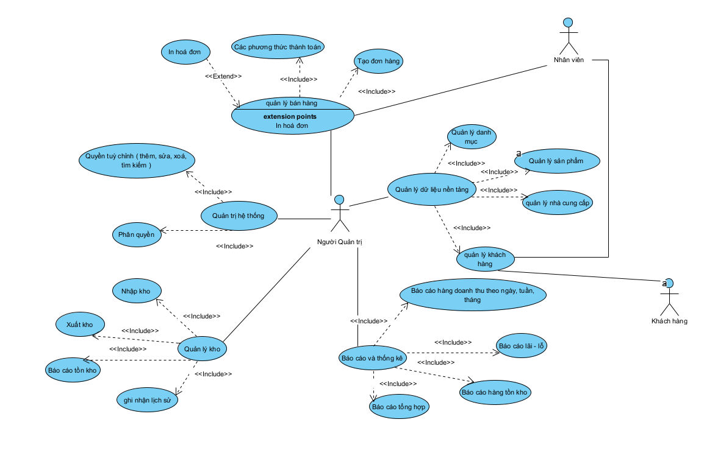
#### 1.4 USECASE đăng nhập

| Tiêu đề              | Nội dung                                                                                                                                                                                                                                                                                                                                           |
| ----------------------- | --------------------------------------------------------------------------------------------------------------------------------------------------------------------------------------------------------------------------------------------------------------------------------------------------------------------------------------------------- |
| Tên use case           | Đăng nhập                                                                                                                                                                                                                                                                                                                                        |
| Tác nhân chính       | Người quản trị, người bán hàng                                                                                                                                                                                                                                                                                                              |
| Mức                    | 1                                                                                                                                                                                                                                                                                                                                                   |
| Điều Kiện            | Người bán hàng phải có một tài khoản hợp lệ được tạo bởi Người quản trị                                                                                                                                                                                                                                                         |
| Đảm bảo tối thiểu  | Hệ thống từ chối truy cập nếu xác thực không thành công và bảo vệ thông tin đăng nhập trong quá trình xác thực                                                                                                                                                                                                                |
| Đảm bảo thành công | Người bán hàng xác thực thành công, phiên làm việc được tạo và hệ thống sẽ điều hướng ngguoiwf bán hàng đến giao diện làm việc phù hợp với vai trò của họ                                                                                                                                                  |
| Kích hoạt             | Người bán hàng mở ứng dụng hoặc truy cập vào một chức năng yêu cầu xác thực                                                                                                                                                                                                                                                        |
| Sự kiện chính        | - Hệ thống hiện thị màn hình đăng nhập yêu cầu username và password -Người dùng nhập thông tin tài khoản -Người dùng nhấn nút đăng nhập -Hệ thống kiểm tra thông tin đăng nhập -Hệ thống xác định vai trò của người dùng -Hệ thống hiển thị giao diện chính tương ứng |
| Ngoại lệ              | -Sai username hoặc password : 1. Hệ thống báo lỗi "tên đăng nhập hoặc mật khẩu không chính xác". 2. Hệ thống sẽ quay lại phần nhập thông tin tài khoản. -Tài khoản bị vô hiệu hóa/khóa: Hệ thống thông báo "tài khoản bi khóa"..                                                              |

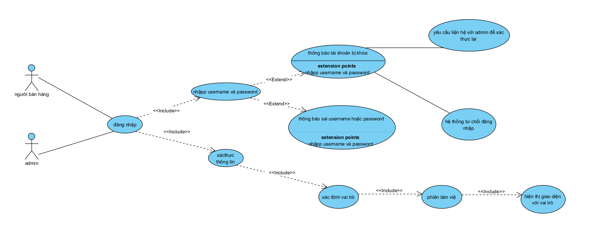

#### 1.5 Gói quản trị hệ thống

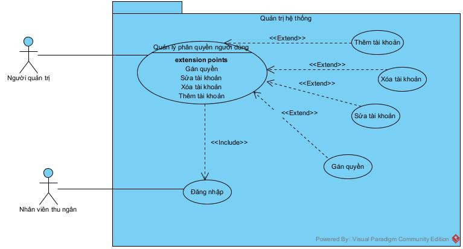

| Tiêu đề                        | Nội dung                                                                                                                                                                                                                                                                                                                                                                                                                                                                                                                                                                                                                                                                                                                                                                                                                                                                                                                                                                                                                                                                                                                                                                                                                           |
| --------------------------------- | ----------------------------------------------------------------------------------------------------------------------------------------------------------------------------------------------------------------------------------------------------------------------------------------------------------------------------------------------------------------------------------------------------------------------------------------------------------------------------------------------------------------------------------------------------------------------------------------------------------------------------------------------------------------------------------------------------------------------------------------------------------------------------------------------------------------------------------------------------------------------------------------------------------------------------------------------------------------------------------------------------------------------------------------------------------------------------------------------------------------------------------------------------------------------------------------------------------------------------------- |
| **Tên USE CASE**           | Quản lý người dùng phân quyền                                                                                                                                                                                                                                                                                                                                                                                                                                                                                                                                                                                                                                                                                                                                                                                                                                                                                                                                                                                                                                                                                                                                                                                                |
| **Tác nhân chính**       | Người quản trị                                                                                                                                                                                                                                                                                                                                                                                                                                                                                                                                                                                                                                                                                                                                                                                                                                                                                                                                                                                                                                                                                                                                                                                                                  |
| **Mức**                    | 2                                                                                                                                                                                                                                                                                                                                                                                                                                                                                                                                                                                                                                                                                                                                                                                                                                                                                                                                                                                                                                                                                                                                                                                                                                   |
| **Tiền điều kiện**      | Người quản trị đăng nhập thành công                                                                                                                                                                                                                                                                                                                                                                                                                                                                                                                                                                                                                                                                                                                                                                                                                                                                                                                                                                                                                                                                                                                                                                                        |
| **Đảm bảo tối thiểu**  | Dữ liệu người dùng hiện tại không bị  thay đổi nếu thao tác quản lý không hoàn  tất hoặc gặp lỗi.                                                                                                                                                                                                                                                                                                                                                                                                                                                                                                                                                                                                                                                                                                                                                                                                                                                                                                                                                                                                                                                                                                   |
| **Đảm bảo thành công** | Thông tin tài khoản và quyền hạn  của người dùng được cập nhật chính xác và  nhất quán trong cơ sở dữ liệu                                                                                                                                                                                                                                                                                                                                                                                                                                                                                                                                                                                                                                                                                                                                                                                                                                                                                                                                                                                                                                                                                       |
| **Kích hoạt**             | Người Quản trị chọn chức năng "Quản lý người dùng và phân quyền".                                                                                                                                                                                                                                                                                                                                                                                                                                                                                                                                                                                                                                                                                                                                                                                                                                                                                                                                                                                                                                                                                                                                              |
| **Chuỗi sự kiện chính** | 1.Hệ thống hiển thị danh sách các tài khoản người dùng hiện có. 2.Người Quản trị lựa chọn một hành động (Extension Point):    A1. Người Quản trị chọn "Thêm mới".    A2. Người Quản trị nhập thông tin (Username, Mật khẩu mặc định, chọn Nhân viên liên kết).    A3. Người Quản trị thực hiện [Gán quyền] (chọn Vai trò: Thu Ngân...).    A4. Người Quản trị chọn "Lưu".    A5. Hệ thống kiểm tra tính hợp lệ (Username không trùng) và tạo tài khoản mới.    B1. Người Quản trị chọn một tài khoản từ danh sách và chọn "Sửa".    B2. Người Quản trị thay đổi thông tin, cập nhật Vai trò ([Gán quyền])  hoặc Trạng thái (Hoạt động/Vô hiệu hóa).    B3. Người Quản trị chọn "Lưu".    B4. Hệ thống cập nhật thông tin tài khoản.    C1. Người Quản trị chọn một tài khoản từ danh sách và chọn "Xóa".    C2. Hệ thống yêu cầu xác nhận việc xóa.    C3. Người Quản trị xác nhận.    C4. Hệ thống kiểm tra ràng buộc dữ liệu và thực hiện xóa tài khoản. |
| **Ngoại lệ**              | **A5a. Username đã tồn tại (Khi thêm mới):**     A5a.1. Hệ thống thông báo lỗi và yêu cầu nhập Username khác. **C4a. Xóa tài khoản đã phát sinh giao dịch (Ví dụ: đã lập hóa đơn, phiếu nhập):**     C4a.1. Hệ thống không cho phép xóa cứng để bảo toàn dữ liệu lịch sử,  khuyến nghị sử dụng chức năng "Vô hiệu hóa" (trong phần Sửa tài khoản). **C4b. Xóa tài khoản đang đăng nhập:**     C4b.1. Hệ thống từ chối yêu cầu xóa tài khoản                                                                                                                                                                                                                                                                                                                                                                                                                                                                                                                                                                                                                                             |

#### 1.6 Gói quản lý bán hàng (Thanh toán hóa đơn),Sơ đồ lớp

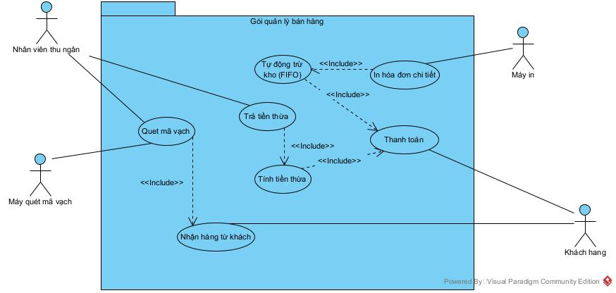

| Tiêu đề                             | Nội dung                                                                                                                                                                                                                                                                                                                                                                                                                                                                                                                                                                                                                                                                                                                                                                                                                                                                                                                                                                                                                                                                                                                                                                           |
| -------------------------------------- | ----------------------------------------------------------------------------------------------------------------------------------------------------------------------------------------------------------------------------------------------------------------------------------------------------------------------------------------------------------------------------------------------------------------------------------------------------------------------------------------------------------------------------------------------------------------------------------------------------------------------------------------------------------------------------------------------------------------------------------------------------------------------------------------------------------------------------------------------------------------------------------------------------------------------------------------------------------------------------------------------------------------------------------------------------------------------------------------------------------------------------------------------------------------------------------- |
| **Tên USE CASE**                | **Thanh toán Hóa đơn**                                                                                                                                                                                                                                                                                                                                                                                                                                                                                                                                                                                                                                                                                                                                                                                                                                                                                                                                                                                                                                                                                                                                                    |
| **Tác nhân**                   | Nhân viên Thu ngân, Khách hàng, Máy quét mã vạch, Máy in                                                                                                                                                                                                                                                                                                                                                                                                                                                                                                                                                                                                                                                                                                                                                                                                                                                                                                                                                                                                                                                                                                             |
| **Mức**                         | 3                                                                                                                                                                                                                                                                                                                                                                                                                                                                                                                                                                                                                                                                                                                                                                                                                                                                                                                                                                                                                                                                                                                                                                                   |
| **Người chịu trách nhiệm:** | Nhân viên Thu ngân.                                                                                                                                                                                                                                                                                                                                                                                                                                                                                                                                                                                                                                                                                                                                                                                                                                                                                                                                                                                                                                                                                                                                                              |
| **Tiền điều kiện:**          | Nhân viên Thu ngân đã đăng nhập vào hệ thống (giao diện POS) Hệ thống kết nối với máy quét mã vạch và máy in hóa đơn Khách hàng đã lựa chọn xong hàng hóa                                                                                                                                                                                                                                                                                                                                                                                                                                                                                                                                                                                                                                                                                                                                                                                                                                                                                                                                                                     |
| **Đảm bảo tối thiểu**       | Giao dịch bị hủy. Không có hóa đơn nào được tạo. Không có sự thay đổi về tồn kho hay doanh thu.                                                                                                                                                                                                                                                                                                                                                                                                                                                                                                                                                                                                                                                                                                                                                                                                                                                                                                                                                                                                                                                            |
| **Đảm bảo thành công**      | Hóa đơn được tạo và lưu trữ. Doanh thu được ghi nhận Hóa đơn được in và giao cho khách hàng (có ghi rõ thông tin). **(Quan trọng)** Tồn kho của các mặt hàng trong hóa đơn được tự động trừ, tuân thủ nghiêm ngặt nguyên tắc FIFO                                                                                                                                                                                                                                                                                                                                                                                                                                                                                                                                                                                                                                                                                                                                                                                                                                                                  |
| **Kích hoạt**                  | Khách hàng mang hàng hóa đến quầy thu ngân để thanh toán                                                                                                                                                                                                                                                                                                                                                                                                                                                                                                                                                                                                                                                                                                                                                                                                                                                                                                                                                                                                                                                                                                                |
| **Chuỗi sự kiện chính**      | NVTN : 1.Bắt đầu phiên giao dịch mới 2.Quét mã vạch sản phẩm (hoặc nhập mã thủ công) Máy quét: 3.Đọc mã vạch và gửi thông tin cho hệ thống Hệ thống: 4.**Nhận hàng từ khách**  - Tìm kiếm thông tin sản phẩm trong database  - Hiển thị tên, giá, tồn kho  - Thêm sản phẩm vào đơn hàng tạm NVTN: 5.Nhập số lượng sản phẩm Hệ thống : 6.Tính tổng tiền cho sản phẩm (giá × số lượng) NVTN: 7.Lặp lại bước 3-7 cho các sản phẩm còn lại Hệ thống: 8.Tính tổng tiền đơn hàng NVTN: 9.Xác nhận hoàn tất quét hàng, bắt đầu thanh toán KH: 10.Đưa tiền cho nhân viên NVTN: 11.Nhập số tiền khách đưa Hệ thống : 12.Tính và trả tiền thừa NVTN: 13.Trả tiền thừa cho khách hàng Hệ thống: 14. Tự động trừ kho theo FIFO 15. In hóa đơn chi tiết Máy in: 16.In hóa đơn NVTN: 17.Đưa hóa đơn và tiền thừa cho khách Hệ thống: 18.Lưu giao dịch |
| **Ngoại lệ:**                  | 4: Mã vạch không đọc được: 4.1.1: Hệ thống: Hiển thị thông báo "Không đọc được mã vạch" 4.1.2: NVTN : a) Thử quét lại (quay lại bước 3) b) Nhập mã vạch thủ công  c) Tìm kiếm sản phẩm theo tên 4.1.4: Tiếp tục bước 5 16: Khách hàng yêu cầu hủy giao dịch 16.1: KH : Yêu cầu hủy giao dịch 16.2: NVTN : Xác nhận hủy với khách hàng 16.3: Hệ thống : Hiển thị popup xác nhận: "Bạn có chắc muốn hủy giao dịch?" 16.4: NVTN : Xác nhận hủy 16.5: Hệ thống: Xác nhận hủy đơn                           Không cập nhật kho                           Trả thông báo                                                                                                                                                                                                                                                                                                                                                                                                                              |

#### 1.7 Gói quản lý kho hàng

a. Usecase nhập hàng vào kho

| Tiêu đề                   | Nội dung                                                                                                                                                                                               |
| ---------------------------- | ------------------------------------------------------------------------------------------------------------------------------------------------------------------------------------------------------- |
| Tên UseCase                 | Nhập hàng vào kho                                                                                                                                                                                    |
| Tác nhân chính            | Chủ tạp hóa                                                                                                                                                                                          |
| Mức                         | 2                                                                                                                                                                                                       |
| Người chịu trách nghiệm | Chủ tạp hóa, máy quét mã vạch                                                                                                                                                                    |
| Tiền điều kiện           | 1. Chủ tạp hóa đã thực hiện đăng nhập 2. Hàng hóa vật lí từ NCC đã về đến kho và đã được kiểm tra 3. Thông tin hàng hóa và NCC đã tồn tại trong hệ thống |
| Đảm bảo tối thiểu       | Phiếu nhập kho không được tạo. Tồn kho trong hệ thống không tha                                                                                                                              |
| Đảm bảo thành công      | 1. Một phiếu nhập kho mới được tạo và lưu trữ 2. Tồn kho được cập nhật, ghi nhận chi tiết theo từng lô hàng và HSD tương ứng                                             |
| Kích hoạt                  | Hàng hóa từ NCC về đến kho và đã được kiểm tra. Chủ tạp hóa thực hiện chức năng lập phiếu nhập kho                                                                               |
| Chuỗi sự kiện chính      | Tác nhân( Chủ tạp hóa) 1. Chọn chức năng "Lập phiếu nhập kho"                                                                                                                           |

#### 1.8 Gói quản lý khách hàng

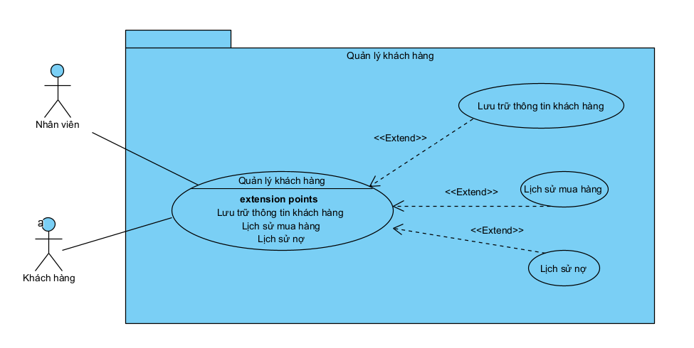

|              Tiêu đề              | Nội dung                                                                                                                                                                                                                                                                                                                                                                                                                                         |
| :-----------------------------------: | ------------------------------------------------------------------------------------------------------------------------------------------------------------------------------------------------------------------------------------------------------------------------------------------------------------------------------------------------------------------------------------------------------------------------------------------------- |
|        **Tên UseCase**        | Lưu trữ thông tin khách hàng                                                                                                                                                                                                                                                                                                                                                                                                                 |
|      **Tác nhân chính**      | Nhân viên, Khách hàng                                                                                                                                                                                                                                                                                                                                                                                                                         |
|            **Mức**            | 3                                                                                                                                                                                                                                                                                                                                                                                                                                                 |
| **Người chịu trách nhiệm** | Nhân viên                                                                                                                                                                                                                                                                                                                                                                                                                                       |
|     **Tiền điểu kiện**     | Nhân viên cần truy cập thành công vào hệ thống                                                                                                                                                                                                                                                                                                                                                                                           |
|   **Đảm bảo tối thiếu**   | Không có dữ liệu sai trong CSDL và tránh ghi đè vào dữ liệu hiện có                                                                                                                                                                                                                                                                                                                                                                  |
|   **Đảm bảo thành công**   | Thông tin khách hàng được lưu thành công trong CSDL                                                                                                                                                                                                                                                                                                                                                                                      |
|         **Kích hoạt**         | Nhân viện chọn chức năng "Lưu trữ thông tin khách hàng"                                                                                                                                                                                                                                                                                                                                                                                |
|      **Chuỗi sự kiện**      | 1. Nhân viên chọn chức năng "Lưu trữ thông tin khách hàng" 2. Hệ thống hiển thị giao diện nhập thông tin khách hàng ( Thêm mới hoặc cập nhật ) 3. Nhân viên nhập đầy đủ các thông tin bắt buộc 4. Nhân viên nhấn nút " Lưu " 5. Hệ thống thông báo  "Lưu trữ thành công "                                                                                                   |
|         **Ngoại lệ**         | **3.a. Nhân viên nhập sai định dạng dữ liệu** 3.a.1. Hệ thống hiển thị thông báo lỗi định dạng dữ liệu  3.a.2. Nhân viên nhập lại thông tin khách hàng 3.a.3. Quay lại bước 3 **4.a. Hệ thống không lưu được dữ liệu** 4.a.1. Hệ thống thông báo lỗi xảy ra 4.a.2. Nhân viên check lại ( wi-fi,  hệ thống, ...) 4.a.3. Thao tác lại bước 4 |

|              Tiêu đề              | Nội dung                                                                                                                                                                                                                |
| :-----------------------------------: | ------------------------------------------------------------------------------------------------------------------------------------------------------------------------------------------------------------------------ |
|        **Tên UseCase**        | Lịch sử mua hàng                                                                                                                                                                                                      |
|      **Tác nhân chính**      | Nhân viên, Khách hàng                                                                                                                                                                                                |
|            **Mức**            | 3                                                                                                                                                                                                                        |
| **Người chịu trách nhiệm** | Nhân viên                                                                                                                                                                                                              |
|     **Tiền điểu kiện**     | 1. Nhân viên cần truy cập thành công vào hệ thống 2. Khách hàng phải tồn tại trong hệ thống                                                                                                        |
|   **Đảm bảo tối thiếu**   | Không có dữ liệu sai và kết nối CSDL                                                                                                                                                                              |
|   **Đảm bảo thành công**   | Hoá đơn phải được thêm vào thông tin khách hàng ngay khi thanh toán                                                                                                                                         |
|         **Kích hoạt**         | Khi nhân viên xử lý thanh toán đơn hàng cho khách hàng                                                                                                                                                         |
|      **Chuỗi sự kiện**      | 1. Nhân viên chọn chức năng  " Lịch sử giao dịch" 2. hệ thống hiển thị thông tin đơn hàng đã mua 3. Nhân viên nhấn vào chi tiết lịch sử đơn hàng                                 |
|         **Ngoại lệ**         | **2.a. Hệ thống không hiển thị lịch sử** 2.a.1. Hệ thống hiển thị lịch sử của khách hàng 2.a.2. Nhân viên kiểm tra lại thông tin và hệ thống   2.a.3. Quay lại bước 2 |

|              Tiêu đề              | Nội dung                                                                                                                                                                                                                                                                                                                                                                                                                                         |
| :-----------------------------------: | ------------------------------------------------------------------------------------------------------------------------------------------------------------------------------------------------------------------------------------------------------------------------------------------------------------------------------------------------------------------------------------------------------------------------------------------------- |
|        **Tên UseCase**        | Lịch sử nợ                                                                                                                                                                                                                                                                                                                                                                                                                                     |
|      **Tác nhân chính**      | Nhân viên, Khách hàng                                                                                                                                                                                                                                                                                                                                                                                                                         |
|            **Mức**            | 3                                                                                                                                                                                                                                                                                                                                                                                                                                                 |
| **Người chịu trách nhiệm** | Nhân viên                                                                                                                                                                                                                                                                                                                                                                                                                                       |
|     **Tiền điểu kiện**     | 1. Nhân viên cần truy cập thành công vào hệ thống 2. Thông tin khách hàng phải có trong hệ thống                                                                                                                                                                                                                                                                                                                            |
|   **Đảm bảo tối thiếu**   | Không có dữ liệu sai trong CSDL và tránh ghi đè vào dữ liệu hiện có                                                                                                                                                                                                                                                                                                                                                                  |
|   **Đảm bảo thành công**   | Thông tin khách hàng được lưu thành công trong CSDL                                                                                                                                                                                                                                                                                                                                                                                      |
|         **Kích hoạt**         | Nhân viện chọn chức năng "Lịch sử nợ"                                                                                                                                                                                                                                                                                                                                                                                                     |
|      **Chuỗi sự kiện**      | 1. Nhân viên chọn chức năng "Lịch sử nợ" 2. Hệ thống hiển thị  thông tin khách hàng có nợ  3. Nhân viên chọn chỉnh sửa thông tin  4. Hệ thống hiển thị giao diện thông tin  5. Nhân viên chỉnh sửa thông tin cần sửa 6.Nhân viên nhấn nút " Lưu " 7. Hệ thống thông báo thành công                                                                             |
|         **Ngoại lệ**         | **5.a. Nhân viên nhập sai định dạng dữ liệu** 5.a.1. Hệ thống hiển thị thông báo lỗi định dạng dữ liệu  5.a.2. Nhân viên nhập lại thông tin khách hàng 5.a.3. Quay lại bước 5 **6.a. Hệ thống không lưu được dữ liệu** 6.a.1. Hệ thống thông báo lỗi xảy ra 6.a.2. Nhân viên check lại ( wi-fi,  hệ thống, ...) 6.a.3. Thao tác lại bước 6 |

#### 1.9 Gói báo cáo thống kê

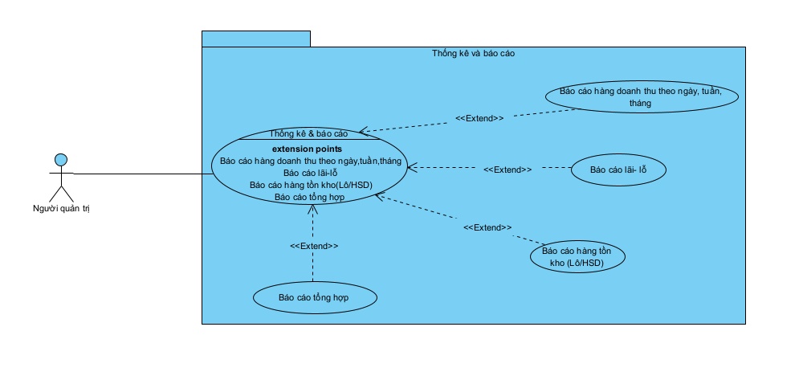

##### 1.9.1 Báo cáo hàng doanh thu theo ngày, tuần,tháng

| Tiêu đề                             | Nội dung                                                                                                                                                                                                                                                                                                                                                                                                                                                                                                              |
| -------------------------------------- | ---------------------------------------------------------------------------------------------------------------------------------------------------------------------------------------------------------------------------------------------------------------------------------------------------------------------------------------------------------------------------------------------------------------------------------------------------------------------------------------------------------------------- |
| **Tên USE CASE**                | Báo cáo Doanh thu                                                                                                                                                                                                                                                                                                                                                                                                                                                                                                    |
| **Tác nhân chính**            | Người quản trị                                                                                                                                                                                                                                                                                                                                                                                                                                                                                                     |
| **Mô tả**                      | Cho phép Người Quản lý xem thống kê về doanh thu bán hàng và số lượng sản phẩm đã bán theo các tiêu chí lọc thời gian (ví dụ: ngày, tuần,tháng,).                                                                                                                                                                                                                                                                                                                                   |
| **Mức**                         | 3                                                                                                                                                                                                                                                                                                                                                                                                                                                                                                                      |
| **Người chịu trách nhiệm:** | Người quản trị                                                                                                                                                                                                                                                                                                                                                                                                                                                                                                     |
| **Tiền điều kiện:**          | Người quản trị đã đăng nhập thành công. Có dữ liệu giao dịch bán hàng (hóa đơn) đã phát sinh trong hệ thống                                                                                                                                                                                                                                                                                                                                                                             |
| **Đảm bảo tối thiểu**       | Hệ thống hiển thị thông báo nếu không tìm thấy dữ liệu phù hợp với tiêu chí lọc  đã chọn                                                                                                                                                                                                                                                                                                                                                                                                    |
| **Đảm bảo thành công**      | Báo cáo doanh thu được hiển thị chính xác (dưới dạng bảng và/hoặc biểu đồ) theo các tiêu chí mà người dùng đã chọn                                                                                                                                                                                                                                                                                                                                                                   |
| **Kích hoạt**                  | Người Quản trị chọn chức năng "Báo cáo Doanh thu".                                                                                                                                                                                                                                                                                                                                                                                                                                                           |
| **Chuỗi sự kiện chính**      | 1. Hệ thống hiển thị giao diện lọc báo cáo 2. Người Quản lý chọn các tiêu chí lọc thời gian (Ví dụ: Từ ngày, Đến ngày hoặc tuần hoặc tháng) 3. (Tùy chọn) Chọn lọc theo **nhóm hàng** (nước ngọt, bánh kẹo…). 4. Nhấn nút **“Xem báo cáo”** . 5. Hệ thống **tổng hợp dữ liệu hóa đơn**  6. Hệ thống hiển thị kết quả báo cáo lên màn hình (Ví dụ :Tổng doanh thu,Số lượng sản phẩm bán ra ) |
| **Ngoại lệ:**                  | **2a. Nhập tiêu chí thời gian không hợp lệ** (Ví dụ: Ngày bắt đầu sau Ngày kết thúc)  2a.1. Hệ thống thông báo lỗi và yêu cầu người dùng nhập lại.                                                                                                                                                                                                                                                                                                                          |

##### 1.9.2 Báo cáo lãi-lỗ

| Tiêu đề                             | Nội dung                                                                                                                                                                                                                                                                                                                                                                                                                                                                                                                                                                                                                  |
| -------------------------------------- | -------------------------------------------------------------------------------------------------------------------------------------------------------------------------------------------------------------------------------------------------------------------------------------------------------------------------------------------------------------------------------------------------------------------------------------------------------------------------------------------------------------------------------------------------------------------------------------------------------------------------- |
| **Tên USE CASE**                | Báo cáo lãi-lỗ                                                                                                                                                                                                                                                                                                                                                                                                                                                                                                                                                                                                         |
| **Tác nhân chính**            | Người quản trị                                                                                                                                                                                                                                                                                                                                                                                                                                                                                                                                                                                                         |
| **Mô tả**                      | Cho phép người quản trị xem**tình hình lãi – lỗ** của cửa hàng trong một khoảng thời gian nhất định dựa  trên doanh thu và chi phí nhập hàng.                                                                                                                                                                                                                                                                                                                                                                                                                                          |
| **Mức**                         | 3                                                                                                                                                                                                                                                                                                                                                                                                                                                                                                                                                                                                                          |
| **Người chịu trách nhiệm:** | Người quản trị                                                                                                                                                                                                                                                                                                                                                                                                                                                                                                                                                                                                         |
| **Tiền điều kiện:**          | 1. Chủ quán đã**đăng nhập thành công** . 2. Hệ thống đã có **dữ liệu bán hàng** và **chi phí nhập hàng** .                                                                                                                                                                                                                                                                                                                                                                                                                                                                  |
| **Đảm bảo tối thiểu**       | Hiển thị thông báo nếu không có dữ liệu trong khoảng thời gian được chọn.                                                                                                                                                                                                                                                                                                                                                                                                                                                                                                                                   |
| **Đảm bảo thành công**      | Hiển thị**chính xác** **số tiền lãi hoặc lỗ** dưới dạng bảng và/hoặc biểu đồ.                                                                                                                                                                                                                                                                                                                                                                                                                                                                                                               |
| Kích hoạt                            | Người quản trị chọn chức năng**“Báo cáo lãi – lỗ"**                                                                                                                                                                                                                                                                                                                                                                                                                                                                                                                                                          |
| **Chuỗi sự kiện chính**      | 1. Hệ thống hiển thị**giao diện chọn thời gian** báo cáo. 2. Người quản trị chọn:      +Từ ngày – đến ngày      + Hoặc tháng / quý 3. Nhấn nút **“Xem báo cáo”** . 4. Hệ thống:      + Tổng hợp **doanh thu bán hàng**      + Tổng hợp **chi phí nhập hàng** 5. Hệ thống **tự động tính toán** :       +Lãi = Doanh thu – Chi phí 6. Hiển thị:       + Tổng doanh thu       + Tổng chi phí       + Số tiền lãi / lỗ        |
| **Ngoại lệ:**                  | **2a. Nhập thời gian không hợp lệ**            + Ví dụ: Ngày bắt đầu > ngày kết thúc          + Hệ thống hiển thị thông báo lỗi          + Yêu cầu người dùng nhập lại  **4a.Thiếu dữ liệu**             + Không có hóa đơn bán hàng          + Không có phiếu nhập          + Hệ thống thông báo: “Không có dữ liệu để thống kê”                                                                                                                                          |

##### 1.9.3 Báo cáo hàng tồn kho

| Tiêu đề                             | Nội dung                                                                                                                                                                                                                                                                                                                                                                            |
| -------------------------------------- | ------------------------------------------------------------------------------------------------------------------------------------------------------------------------------------------------------------------------------------------------------------------------------------------------------------------------------------------------------------------------------------ |
| **Tên USE CASE**                | Báo cáo Tồn kho (Lô/HSD)                                                                                                                                                                                                                                                                                                                                                         |
| **Tác nhân chính**            | Người Quản trị                                                                                                                                                                                                                                                                                                                                                                   |
| **Mô tả**                      | Cung cấp báo cáo chi tiết về tình trạng tồn kho hiện tại của tất cả mặt hàng bao gồm chi tiết số lượng tồn  theo từng Mã Lô và Hạn sử dụng tương ứng                                                                                                                                                                                       |
| **Mức**                         | 3                                                                                                                                                                                                                                                                                                                                                                                    |
| **Người chịu trách nhiệm:** | Người Quản trị                                                                                                                                                                                                                                                                                                                                                                   |
| **Tiền điều kiện:**          | Người Quản trị đã đăng nhập. Có dữ liệu tồn kho trong hệ thống.                                                                                                                                                                                                                                                                                                      |
| **Đảm bảo tối thiểu**       | Hệ thống hiển thị dữ liệu tồn kho hiện tại, ngay cả khi số lượng tồn bằng 0 (nếu được yêu cầu                                                                                                                                                                                                                                                                 |
| **Đảm bảo thành công**      | Báo cáo hiển thị chính xác và đầy đủ tình trạng tồn kho chi tiết theo Lô/HSD theo thời gian thực.                                                                                                                                                                                                                                                                 |
| **Kích hoạt**                  | Người Quản trị chọn chức năng "Báo cáo Tồn kho (Lô/HSD)".                                                                                                                                                                                                                                                                                                               |
| **Chuỗi sự kiện chính**      | 1._(Tùy chọn)_ Người Quản trị nhập tiêu chí lọc (Ví dụ: theo Ngành hàng hoặc Mã hàng cụ thể). 2. Người Quản lý nhấn nút "Xem Báo cáo". 3. Hệ thống truy vấn toàn bộ dữ liệu tồn kho hiện tại. 4. Hệ thống hiển thị báo cáo, nhóm theo mặt hàng và liệt kê chi tiết các Lô/HSD bên trong mỗi mặt hàng |
| **Ngoại lệ:**                  | Không có ngoại lệ nghiệp vụ đáng kể                                                                                                                                                                                                                                                                                                                                         |

##### 1.9.4 Báo cáo tổng hợp

| Tiêu đề                             | Nội dung                                                                                                                                                                                                                                                                                                                                                                                                                                                                                                                                                                                                                                                                                                    |
| -------------------------------------- | ------------------------------------------------------------------------------------------------------------------------------------------------------------------------------------------------------------------------------------------------------------------------------------------------------------------------------------------------------------------------------------------------------------------------------------------------------------------------------------------------------------------------------------------------------------------------------------------------------------------------------------------------------------------------------------------------------------ |
| **Tên USE CASE**                | Báo cáo tổng hợp                                                                                                                                                                                                                                                                                                                                                                                                                                                                                                                                                                                                                                                                                         |
| **Tác nhân chính**            | Người quản trị                                                                                                                                                                                                                                                                                                                                                                                                                                                                                                                                                                                                                                                                                           |
| **Mô tả**                      | Cho phép quản trị xem** báo cáo tổng hợp tình hình kinh doanh **gồm: doanh thu, chi phí, lãi – lỗ, số lượng  sản phẩm bán ra và tồn kho trong khoảng thời gian xác định.                                                                                                                                                                                                                                                                                                                                                                                                                                                                                                   |
| **Mức**                         | 3                                                                                                                                                                                                                                                                                                                                                                                                                                                                                                                                                                                                                                                                                                            |
| **Người chịu trách nhiệm:** | Người quản trị                                                                                                                                                                                                                                                                                                                                                                                                                                                                                                                                                                                                                                                                                           |
| **Tiền điều kiện:**          | 1. Người quản lý đã**đ\*\***ăng nhập thành công\*\* . 2. Hệ thống có dữ liệu: hóa đơn bán, phiếu nhập, tồn kho.                                                                                                                                                                                                                                                                                                                                                                                                                                                                                                                                                                |
| **Đảm bảo tối thiểu**       | Hiển thị thông báo nếu**không có dữ liệu phù hợp**                                                                                                                                                                                                                                                                                                                                                                                                                                                                                                                                                                                                                                          |
| **Đảm bảo thành công**      | Báo cáo tổng hợp hiển thị**đầy đủ – chính xác dưới dạng bảng và biểu đồ.**                                                                                                                                                                                                                                                                                                                                                                                                                                                                                                                                                                                                        |
| **Kích hoạt**                  | Người quản trị chọn chức năng**“Báo cáo tổng hợp”**                                                                                                                                                                                                                                                                                                                                                                                                                                                                                                                                                                                                                                            |
| **Chuỗi sự kiện chính**      | 1. Hệ thống hiển thị**giao diện chọn thời gian báo cáo** . 2. Người quản lý chọn:       + Khoảng ngày (từ ngày – đến ngày)       + Hoặc theo tháng / quý 3. Nhấn nút **“Xem báo cáo”**  4. Hệ thống :       + Tổng hợp doanh thu       + Tổng hợp chi phí nhập hàng       + Tính lãi – lỗ       + Thống kê số lượng sản phẩm bán       + Thống kê tồn kho 5. Hệ thống hiển thị:        + Tổng doanh thu        + Tổng chi phí        + Lãi / lỗ        + Top sản phẩm bán chạy      |
| **Ngoại lệ**                   | **2a. Thời gian nhập không hợp lệ**      + Ngày bắt đầu > ngày kết thúc      + Hệ thống thông báo lỗi      + Yêu cầu nhập lại **4a. Không có dữ liệu**       + Không có giao dịch bán       + Không có phiếu nhập       + Hệ thống hiển thị : " Không có dữ liệu"                                                                                                                                                                                                                                                                                                                           |

#### 1.10. Quản lý nhà cung cấp

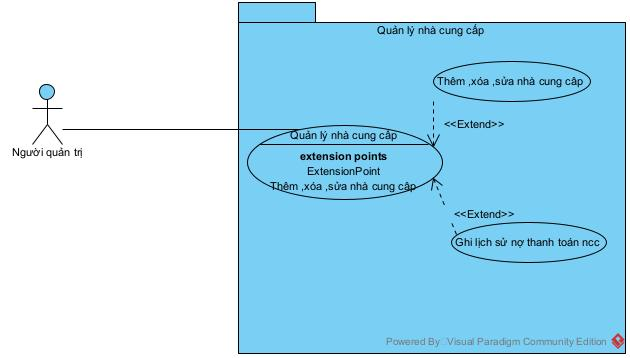

| Tiêu đề                  | Nội dung                                                                                                                                                                                                                                                                                                                                                                                                         |
| --------------------------- | ----------------------------------------------------------------------------------------------------------------------------------------------------------------------------------------------------------------------------------------------------------------------------------------------------------------------------------------------------------------------------------------------------------------- |
| **Tên UseCase**      | Thêm xóa sửa nhà cung cấp                                                                                                                                                                                                                                                                                                                                                                                    |
| **Tác nhân chính** | Người quản trị                                                                                                                                                                                                                                                                                                                                                                                                |
| Mô tả                     | Thêm,xóa,sửa nhà cung cấp                                                                                                                                                                                                                                                                                                                                                                                    |
| Mức                        | 1                                                                                                                                                                                                                                                                                                                                                                                                                 |
| Tiền điều kiện          | Người quản trí đã đăng nhập vào hệ thống thành công                                                                                                                                                                                                                                                                                                                                                 |
| Đảm bảo tối thiểu      | Dữ liệu không bị thay đổi nếu thao tác bị hủy giữa chừng                                                                                                                                                                                                                                                                                                                                              |
| Đảm bảo thành công     | Thông tin nhà cung cấp được lưu chính xác vào cơ sở dữ liệu                                                                                                                                                                                                                                                                                                                                         |
| Kích hoạt                 | Người quản trí truy cập vào màn hình "Quản lý nhà cung cấp" và chọn các thao tác                                                                                                                                                                                                                                                                                                             |
| Chuỗi sự kiện chính     | 1.Người quản trí: Truy cập màn hình "Quản lý nhà cung cấp" 2.Hệ thống: Hiển thị danh sách nhà cung cấp hiện có 3.Người quản trí: Nhấn nút "Thêm mới" 4.Hệ thống : hiển thị form ncc 5.Người quản trị: Nhập đầy đủ thông tin vào các trường                             Lưu 6.Hệ thống : Lưu database |
| Ngoại lệ                  | 3. Lỗi thêm xóa sửa nhà cung cấp 3.1 Hệ thống hiển thị thông báo lỗi cụ thể bên cạnh trường nhập sai: 3.2 Hệ thống giữ nguyên dữ liệu đã nhập 3.3 Người quản trị: sửa lại thông tin quay về bước 2                                                                                                                                                        |

#### 1.11. Quản lý sản danh mục

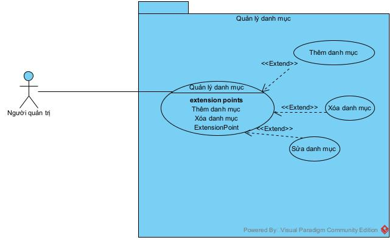

a) Thêm danh mục

| Tiêu đề              | Nội dung                                                                                                                                                                                                                                                                                                                     |
| ----------------------- | ----------------------------------------------------------------------------------------------------------------------------------------------------------------------------------------------------------------------------------------------------------------------------------------------------------------------------- |
| Tên UseCase            | Thêm danh mục                                                                                                                                                                                                                                                                                                               |
| Tác nhân chính       | Người quản lý                                                                                                                                                                                                                                                                                                             |
| Mô tả                 | Cho phép thêm danh mục mới                                                                                                                                                                                                                                                                                                |
| Mức                    | 3                                                                                                                                                                                                                                                                                                                             |
| Tiền điều kiện      | Người quản lý đăng nhập thành công                                                                                                                                                                                                                                                                                   |
| Đảm bảo tối thiểu  | Nếu Người Quản lý hủy thao tác, danh mục mới sẽ không được lưu vào CSDL.                                                                                                                                                                                                                                 |
| Đảm bảo thành công | Danh mục mới với các thông tin (Mã, Tên, Mô tả) được lưu thành công vào CSDL                                                                                                                                                                                                                             |
| Kích hoạt             | Người Quản lý nhấn nút "Thêm mới" trên giao diện quản lý danh mục.                                                                                                                                                                                                                                          |
| Chuỗi sự kiện chính | Hệ thống hiển thị Form thêm mới,yêu cầu nhập: Tên danh mục, Mô tả. Người Quản lý nhập đầy đủ thông tin và nhấn "Lưu". Hệ thống kiểm tra tính hợp lệ của dữ liệu. Hệ thống lưu thông tin danh mục mới vào CSDL. Hệ thống thông báo thêm mới thành công. |
| Ngoại lệ              | Tên danh mục đã tồn tại:   Hệ thống thông báo lỗi "Tên danh mục đã tồn tại"   Hệ thống yêu cầu Người Quản lý nhập lại Tên khác.   Quản lý nhập lại tên                                                                                                               |

### 2.Các biểu đồ tuần tự

#### 2.1 Biều đồ tuần tự đăng nhập

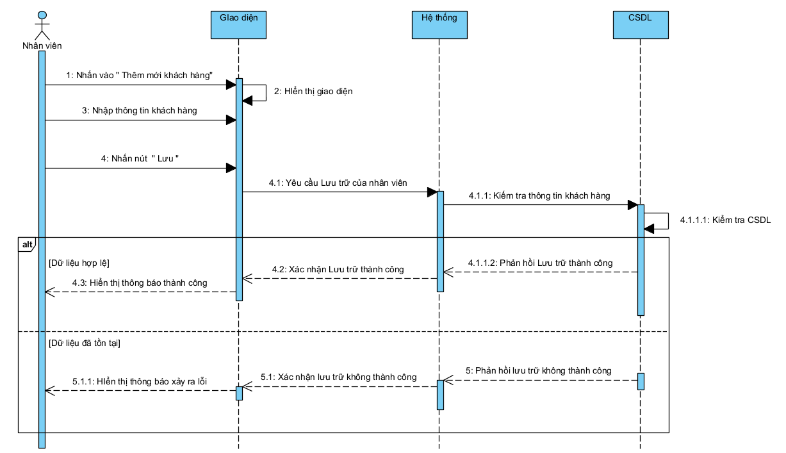

#### 2.2 Biểu đồ tuần tự kho hàng

#### 2.3 Biểu đồ tuần tự khách hàng

**a. Biểu đồ tuần tự " Lưu trữ khách hàng ":**

**Mô tả luồng hoạt động:**

    **1. Nhập thông tin**: Nhân viên sẽ chọn chức năng thêm mới khách hàng và nhấn lưu trên màn hình giao diện nhập liệu

    **2. Yều cầu tạo:** Hệ thống sẽ nhận điều khiển gửi đến từ giao diện

    **3. Xử lý kết quả: ( alt )**

    -**Dữ liệu hợp lệ :** Nếu thông tin nhập đầy đủ, không lỗi định dạng thì sẽ lưu và thông báo ra màn hình

    -**Dữ liệu đã tồn tại**: Kiểm tra CSDL nếu phát hiện đã tồn tại thì trả về thông báo màn hình đã tồn tại khách hàng

**b. Biểu đồ tuần tự " Lịch sử mua hàng ":**

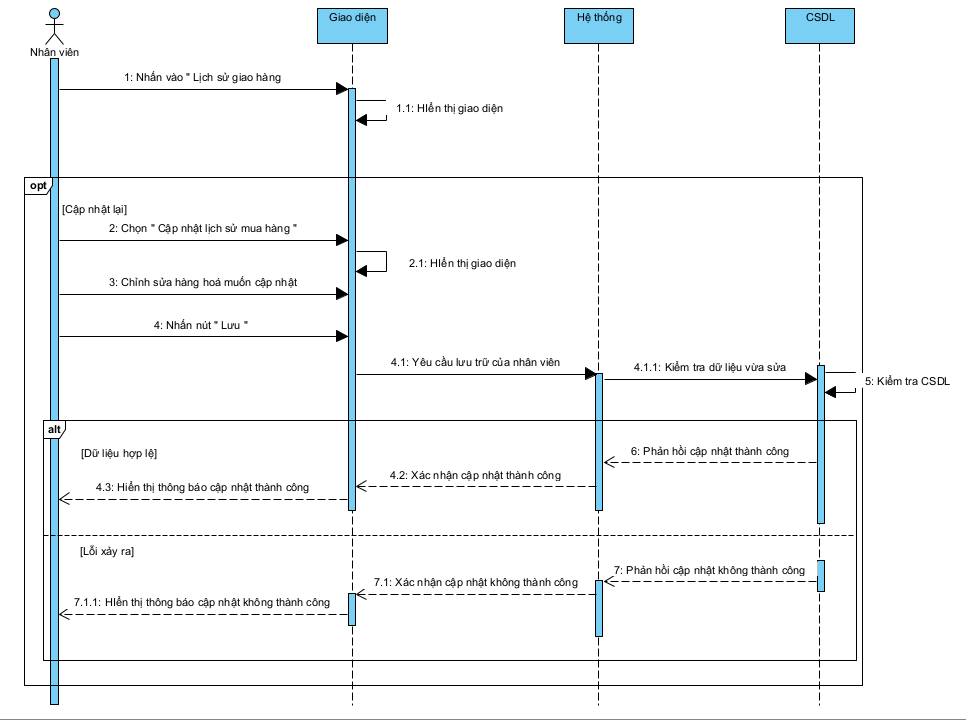

**Mô tả luồng hoạt động:**

    **1. Nhập thông tin**: Nhân viên sẽ chọn chức năng Hiển thị lịch sử mua hàng

    **2. Yều cầu tạo:** Hệ thống sẽ nhận điều khiển gửi đến từ giao diện và trả về dữ liệu lịch sử mua hàng

    **3. Xử lý kết quả: ( option và alt )**

    -**Dữ liệu hợp lệ :** Nếu thông tin nhập đầy đủ, không lỗi định dạng thì sẽ cập nhật lại và thông báo ra màn hình thành công

    -**Lỗi xảy ra** : Kiểm tra CSDL nếu phát hiện đã tồn tại hay không có thông tin sản phẩm mới sửa thì trả về thông báo màn hình có lỗi

**c. Biểu đồ tuần tự " Lịch sử Nợ "**

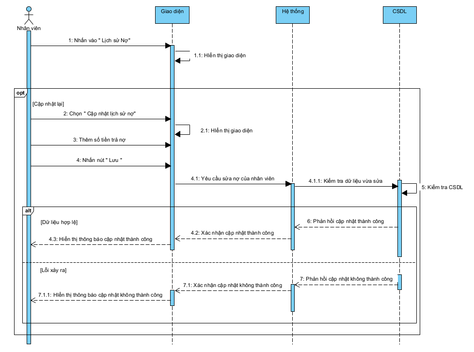

#### Mô tả luồng hoạt động:

    **1. Nhập thông tin**: Nhân viên sẽ chọn chức năng Hiển thị lịch sử nợ

    **2. Yều cầu tạo:** Hệ thống sẽ nhận điều khiển gửi đến từ giao diện và trả về dữ liệu lịch sử nợ

    **3. Xử lý kết quả: ( option và alt )**

    -**Dữ liệu hợp lệ :** Nếu thông tin nhập đầy đủ, không lỗi định dạng thì sẽ cập nhật lại và thông báo ra màn hình thành công

    -**Lỗi xảy ra** : Kiểm tra CSDL nếusố tiền nhập vào bị sai định dạng hoặc quá số tiền hiện có thì trả về thông báo màn hình có lỗi

#### 2.4 Biểu đồ tuần tự bán hàng

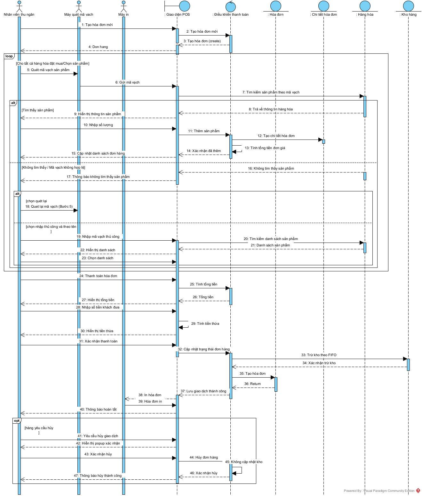

## a. Luồng sự kiện chính (Thanh toán thành công)

1. **Kích hoạt:** Nhân viên Thu ngân (NVTN) bắt đầu một phiên thanh toán mới bằng cách nhấn vào nút "Tạo hóa đơn mới" trên giao diện POS.
2. **Hệ thống phản hồi:** Hệ thống tạo một đối tượng Hóa đơn mới ở trạng thái "Đang xử lý".
3. **Quét sản phẩm:** NVTN lần lượt dùng máy quét để quét mã vạch trên từng sản phẩm của khách hàng.
4. **Xử lý và phân loại mã vạch:** Với mỗi mã vạch được quét, hệ thống tự động phân tích và xử lý:

   - Nếu là mã vạch từ nhà cung cấp (hàng khô), hệ thống sẽ truy vấn CSDL để lấy tên và đơn giá, sau đó thêm một dòng chi tiết vào hóa đơn.
   - Nếu là mã vạch từ quầy cân (hàng tươi sống), hệ thống sẽ giải mã để lấy thông tin tên hàng và thành tiền đã được mã hóa sẵn, sau đó thêm một dòng chi tiết vào hóa đơn.
5. **Cập nhật liên tục:** Sau mỗi lần quét, hệ thống tự động tính lại tổng tiền của hóa đơn và cập nhật hiển thị chi tiết trên màn hình cho NVTN và khách hàng theo dõi.
6. **Xử lý thanh toán:** Sau khi quét hết sản phẩm, NVTN nhập số tiền khách đưa. Hệ thống sẽ tính toán và hiển thị số tiền thừa cần trả lại.
7. **Hoàn tất giao dịch:** NVTN nhấn nút "Hoàn tất". Hệ thống thực hiện đồng thời các tác vụ cuối cùng:

   - Cập nhật trạng thái hóa đơn thành "Hoàn tất" và lưu vào CSDL.
   - Gửi lệnh in hóa đơn chi tiết ra máy in.
   - Gửi yêu cầu đến hệ thống Kho hàng để tự động trừ số lượng tồn kho của các mặt hàng đã bán theo nguyên tắc FIFO (hàng nhập trước, xuất trước).
8. **Kết thúc:** NVTN trao hóa đơn và tiền thừa (nếu có) cho khách hàng.

---

## b. Các luồng rẽ nhánh

### Ngoại lệ: Mã vạch không hợp lệ

**Tại bước 4:** Nếu mã vạch quét vào không tồn tại trong hệ thống hoặc không thể giải mã, hệ thống sẽ:

- Phát ra âm báo lỗi
- Hiển thị thông báo "Mã vạch không hợp lệ" trên màn hình

**Xử lý:** NVTN có các lựa chọn sau:

- **Quét lại:** Thử quét lại mã vạch (quay lại bước 3)
- **Nhập thủ công:** Nhập mã vạch bằng bàn phím
- **Tìm kiếm theo tên:** Tìm sản phẩm bằng cách nhập tên hoặc từ khóa, sau đó chọn sản phẩm từ danh sách kết quả
- **Bỏ qua:** Không thêm sản phẩm này vào hóa đơn

Sau khi xử lý xong, tiếp tục bước 5 (Cập nhật liên tục).

### Ngoại lệ: Khách hàng hủy hóa đơn**Thời điểm xảy ra:** Tại bất kỳ thời điểm nào trước khi NVTN nhấn "Hoàn tất" (bước 7).

**Điều kiện:** Khách hàng đổi ý không mua nữa hoặc NVTN cần hủy giao dịch vì lý do khác.

**Quy trình:**

1. NVTN chọn chức năng "Hủy hóa đơn" trên giao diện POS.
2. Hệ thống hiển thị popup xác nhận: "Bạn có chắc muốn hủy giao dịch?"
3. NVTN xác nhận hủy.
4. Hệ thống thực hiện:
   - Hủy bỏ hoàn toàn đối tượng Hóa đơn đang xử lý (không lưu vào CSDL)
   - **Không** cập nhật kho hàng (vì chưa có giao dịch thành công)
   - Quay trở về màn hình bắt đầu, sẵn sàng cho giao dịch tiếp theo
5. Hệ thống thông báo "Đã hủy giao dịch thành công"

#### 2.5 Biểu đồ tuần tự thống kê

###### **2.5.1 Báo cáo doanh thu**

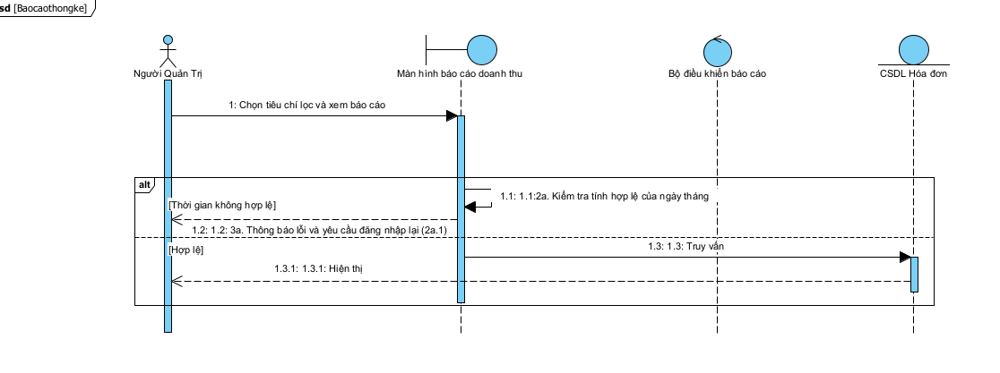

**Mô tả luồng hoạt động**

**1.Nhập tiêu chí:** Người Quản lý chọn tiêu chí lọc (thời gian) và nhấn Xem Báo cáo.

2.**Kiểm tra hợp lệ (alt):** Việc kiểm tra tính hợp lệ của ngày tháng được thực hiện ngay tại
Boundary.

+ **[Thời gian không hợp lệ]:** Boundary phát hiện lỗi (ví dụ: Ngày bắt đầu       Ngày kết thúc) và yêu
  cầu Người Quản lý nhập lại.
+ **[Hợp lệ]:** Boundary gửi yêu cầu đến Control. Control thực
  hiện truy vấn và tổng hợp dữ liệu từ CSDL Hóa đơn. Kết quả được trả về và hiển
  thị cho Người Quản lý.

###### 2.5.2 Báo cáo lãi- lỗ

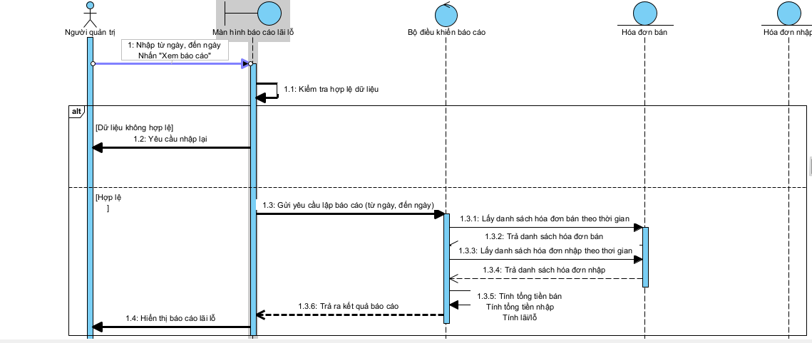

**1.** Người Quản trị nhập **khoảng thời gian** cần xem báo cáo (Từ ngày – Đến ngày) và nhấn  **Xem báo cáo**

**2.** **Kiểm tra hợp lệ** (alt):

- **[Thời gian không hợp lệ]**

+Boundary kiểm tra dữ liệu nhập (ví dụ:

+ Ngày bắt đầu > ngày kết thúc
+ Bỏ trống dữ liệu
+ Định dạng sai

+Boundary hiển thị thông báo lỗi

+Yêu cầu Người Quản lý nhập lại

- **[Hợp lệ]**

  +Boundary gửi yêu cầu đến **Control**

  +Control truy vấn dữ liệu **thu – chi** từ **Entity (CSDL)**

  +Sau đó Control thực hiện xử lý:

  -Tính **tổng doanh thu**

  -Tính **tổng chi phí**

  -Tính **lãi/lỗ = Doanh thu – Chi phí** *(Self-Message)*

  +Kết quả đã xử lý được trả về Boundary

  +Boundary hiển thị**báo cáo lãi – lỗ** cho Người Quản lý

###### 2.5.3 Báo cáo Hàng tồn kho

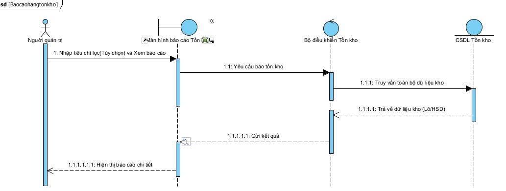

**Mô tả luồng hoạt động:**

1. **Nhập tiêu chí (Tùy chọn):** Người Quản Trị nhập tiêu chí lọc (nếu có) và nhấn Xem Báo cáo.
2. **Truy vấn:** Boundary gửi yêu cầu đến Control.
3. **Lấy dữ liệu:** Control truy vấn toàn bộ dữ liệu tồn kho chi tiết từ Entity.
4. **Hiển thị :** Dữ liệu chi tiết về Lô/HSD được trả về và hiển
   thị cho Người Quản lý.

###### 2.5.4 Báo cáo tổng hợp

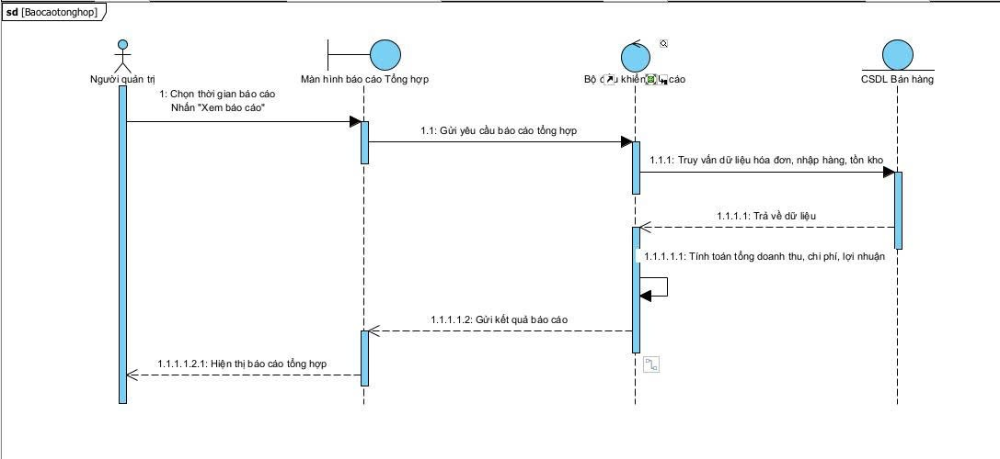

**Mô tả luồng động:**

1. **Người Quản trị** nhập khoảng thời gian cần xem báo cáo (từ ngày – đến ngày) và nhấn **Xem báo cáo** trên màn hình.
2. **Màn hình Báo cáo Tổng hợp (Boundary)** kiểm tra tính hợp lệ của khoảng thời gian.

* **[Không hợp lệ]** : Thông báo lỗi và yêu cầu nhập lại.
* **[Hợp lệ]** : Gửi yêu cầu tạo báo cáo đến  **Bộ điều khiển Báo cáo (Control)** .

3. **Bộ điều khiển Báo cáo** nhận yêu cầu và gửi lệnh truy vấn đến **CSDL Bán   hàng (Entity)** để lấy các dữ liệu liên quan trong khoảng thời gian đã chọn, bao gồm:

* Hóa đơn bán hàng
* Phiếu nhập hàng
* Dữ liệu tồn kho

4. **CSDL Bán hàng** xử lý truy vấn và trả toàn bộ dữ liệu cần thiết về cho  **Bộ điều khiển Báo cáo** .
5. **Bộ điều khiển Báo cáo** thực hiện xử lý nội bộ (Self-Message):

* Tính **tổng doanh thu**
* Tính **tổng chi phí nhập hàng**
* Tính **lợi nhuận**
* Thống kê **số lượng hàng đã bán**
* Thống kê **tồn kho hiện tại**

6.Sau khi tính toán xong, **Bộ điều khiển** gửi kết quả báo cáo tổng hợp về lại  **Màn hình Báo cáo Tổng hợp** .

7.**Màn hình** hiển thị báo cáo chi tiết cho **Người Quản Trị** xem.

#### 2.6 Quản lý danh mục

#### 2.7 Quản lý nhà cung cấp

### 3.Sơ đồ lớp tổng quát

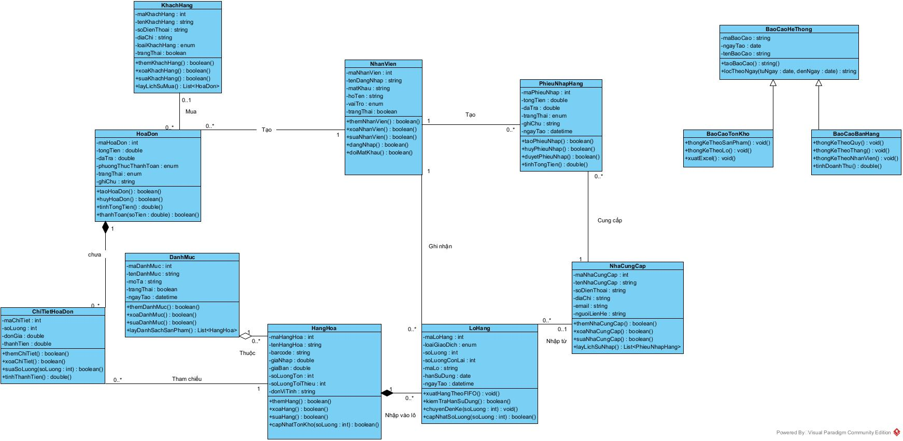

## **4. Tổng kết**

### 4.1 Tổng kết các kết quả đạt được

### 4.2 Đánh gia ưu nhược điểm

### 4.3 Hướng phát triển trong tương lại
